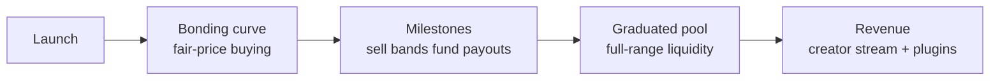

# Spawn

Spawn is a token launchpad on [Base](https://base.org), built as a **single Uniswap v4 hook**. Every launch is one pool that starts as a bonding curve and matures in place — there is no factory, no migration, and no separate AMM.

The differentiator is the **milestone ladder**: a protocol-owned ladder of one-sided sell bands at ascending valuations. Each time the price crosses a band's top, real liquidity is retired and the proceeds fund a payout pot — paid out to the creator's revenue stream and to on-chain payout plugins, not parked in a treasury.

<table data-view="cards">
<thead>
<tr><th></th><th></th><th data-hidden></th></tr>
</thead>
<tbody>
<tr><td><strong>I want to launch a token</strong></td><td>Reserve a deterministic address, sign your config, launch with an optional dev buy.</td><td><a href="user/launching-a-token.md">Launching a token</a></td></tr>
<tr><td><strong>I want to trade</strong></td><td>Buy into the curve, sell into the ladder, understand the 1% fee and graduation.</td><td><a href="user/trading.md">Trading</a></td></tr>
<tr><td><strong>I launched — where is my money?</strong></td><td>Revenue accrues to a tradable NFT. Claim anytime, or sell the stream.</td><td><a href="user/revenue-and-claims.md">Revenue and claims</a></td></tr>
<tr><td><strong>What are payout plugins?</strong></td><td>On-chain destinations for milestone proceeds — buyback-and-burn ships by default.</td><td><a href="user/payout-plugins.md">Payout plugins</a></td></tr>
</tbody>
</table>

## The shape of a launch

## Ground rules


**Four facts that hold for every launch:**

- The trading fee is **1%**, forever — buys pay it in ETH, sells in token.
- **Nobody can provide liquidity** except the protocol. Trading is the only pool interaction.
- The supply is **fixed** — 1,000,000,000 tokens for every launch; the only supply decrease is explicit token burns.
- Launches are **pre-deployment on testnet today** — treat all addresses as provisional until the deployment manifest is published.


## Going deeper

The [Technical reference](technical/integration.md) covers architecture, deployment, the event catalog, and the full integration handoff for frontends and indexers.
