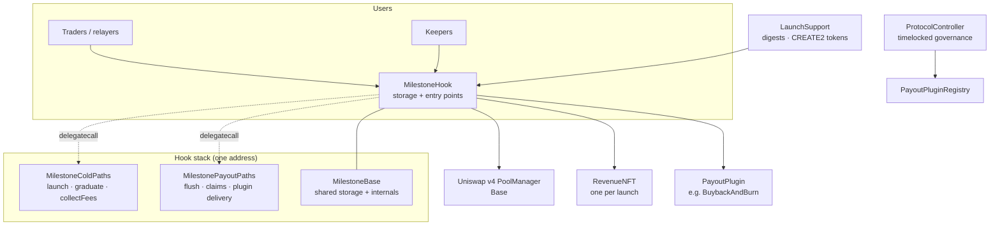

# Architecture

## The mental model

One deployed `MilestoneHook` serves **every** launch; per-launch state is keyed by `PoolId`. There is no factory and no migration — a launch is one pool that morphs in place from bonding curve to graduated.

## Contract map

| Contract | Role |
| --- | --- |
| `MilestoneHook` | The protocol core: launch entry, graduation, fee collection, flush, all claim paths, every view. Holds all per-pool state. |
| `MilestoneBase` | Abstract shared storage and internal logic the satellites execute against. |
| `MilestoneColdPaths` / `MilestonePayoutPaths` | **Delegatecall implementations**, not callable contracts. Every entry is `onlyDelegated` and reverts when called directly. |
| `LaunchSupport` | Read-only observers for the signed-launch flow plus the CREATE2 deployer of every launch token. |
| `MilestoneToken` | Per-launch ERC20 with one extra: `burn(uint256)`. Whole supply mints to the hook. |
| `RevenueNFT` | One per launch, minted to the creator; the current holder owns the revenue claim right. |
| `PayoutPluginRegistry` | Append-only plugin registry with stable indices 0–255. |
| `ProtocolController` | Timelocked governance: economics tuple, plugin registration/suspension, protocol recipient, delay. |
| `BuybackAndBurnPlugin` | The reference PAYOUT plugin, canonical plan index 0. |


Ship **only the hook's ABI** to signers and integrators. The satellite ABIs exist for source verification only — every state-changing satellite entry reverts when called directly.


## Why satellites

EIP-170 limits contracts to 24 KB. The hook's logic cannot fit in one artifact, so immutable entry-point groups live in satellite artifacts that execute via `delegatecall` against the hook's storage. The split is enforced by CI gates: a [storage-layout check](testing-and-gates.md) proves the satellites never diverge from `MilestoneBase`, and a cold-path-guard check proves no satellite entry is reachable directly.

## Coordinate system

Native ETH is `currency0`, the launch token `currency1`, so raw v4 price is token-per-ETH and **ticks run opposite to price**. The protocol's user-facing coordinate is `level = -tick`, which rises as the token pumps; derived values are exact: `ethPerToken = 1.0001^level`, `FDV = totalSupply × 1.0001^level`. Convert at the pool boundary once, then do everything in level space. Template distances: 6931 levels per 2x, 2235 per ladder rung, 447 band width.

The full integration surface — flows, quoting, the event catalog, view reads, batching — is in the [integration guide](integration.md).
