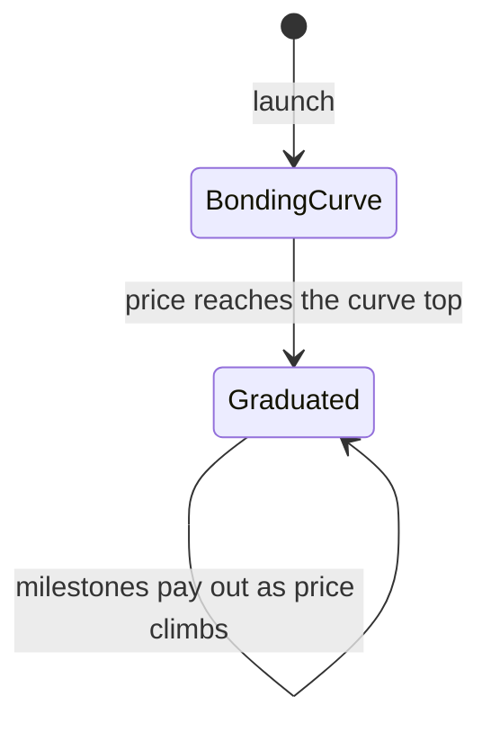

# How it works

Every Spawn token lives in one pool that moves through three one-way phases.

## Phase 1 — Bonding curve

A launch mints the whole fixed supply to the hook and seeds a **bonding curve**: 32 liquidity positions spread over a price span that ends at **2x the opening valuation**. Every launch opens at the same valuation (125 ETH fully-diluted), so day-one pricing is fair and identical for everyone.

- Buying moves the price up the curve. Liquidity for later positions is deployed **just-in-time** as the price approaches them.
- There is no token in the pool above the curve top — the curve *is* the raise.
- The creator can buy a slice of supply at launch (the **dev buy**, capped at 10%) — everyone else buys on the same curve at the same price.

## Phase 2 — The milestone ladder (the differentiator)

When the price reaches the curve top, the pool **graduates** automatically:

- Curve liquidity is burned and replaced by one **full-range position** (40% of curve proceeds) that is code-locked — it can never be removed.
- Curve proceeds split **40% liquidity / 55% creator / 5% protocol**.
- The next 65% of supply is loaded into a **ladder of 30 one-sided sell bands** at ascending valuations, each rung **1.2504x** the last. As price keeps climbing, each band is sold *into* the pump and its proceeds fund the pool's payout pot.


This is what makes Spawn different: price increases after graduation **retire real liquidity** and pay people — the creator, on-chain plugins (like buyback-and-burn), and the protocol — instead of just making a chart go up.


After the core ladder, up to 30 extra rungs are funded by the token-side fee stream, so the ladder keeps paying as long as the token keeps climbing.

## Phase 3 — Graduated, permanently

Graduation is one-way. From then on:

- Trading continues on the graduated pool with full-range liquidity under it.
- Every milestone crossing funds the payout pot, which is flushed to the launch's selected [payout plugins](payout-plugins.md) and the creator's revenue stream.
- The creator's revenue lives in a [claimable stream represented by an NFT](revenue-and-claims.md).

## Where value flows

| Source | Split |
| --- | --- |
| Graduation (curve proceeds) | 40% LP seed · 55% creator · 5% protocol |
| Trading fees (ETH side) | 75% creator · 25% protocol |
| Trading fees (token side) | 20% next-rung funding · 80% burn |
| Milestone harvests | 10% service fee · 90% payout pot |


These are the shipped defaults. Governance can move the last three rows within hard caps — never past them, and changes apply only to future milestones. The exact numbers live in the [economics reference](../technical/economics-and-governance.md).

